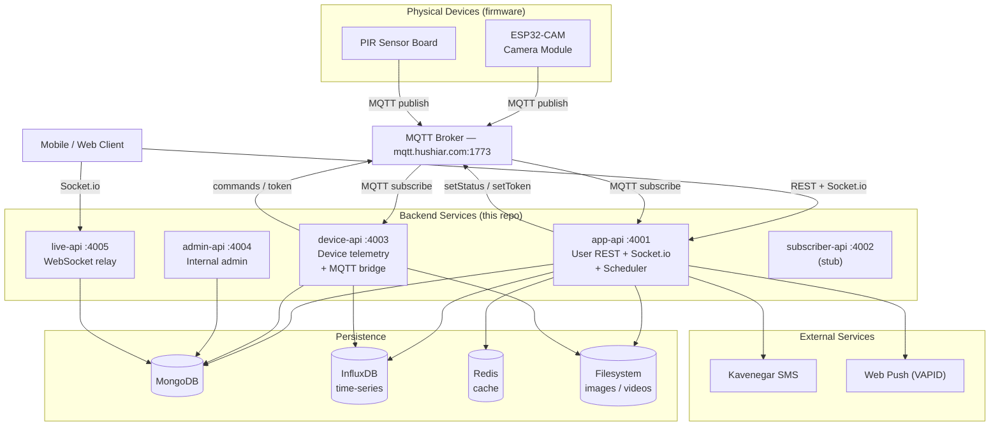
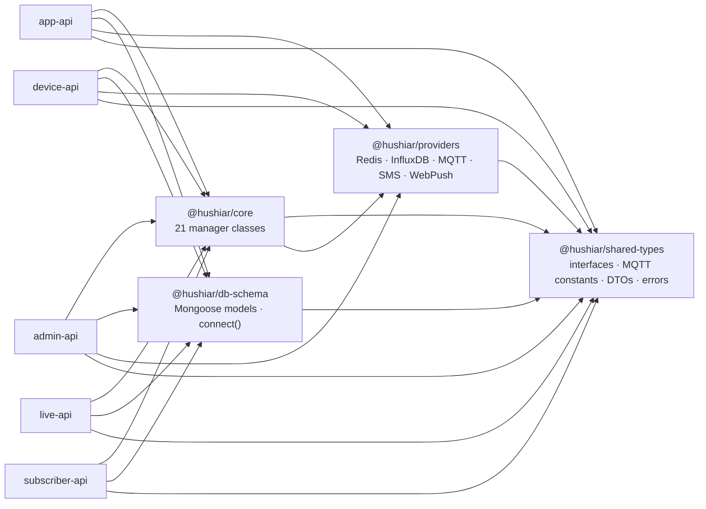

# Hushiar — IoT Home Security Platform

Hushiar is a pnpm monorepo containing five backend services for a self-hosted IoT security system. Physical cameras and PIR sensors communicate over MQTT; users interact through a REST API backed by real-time Socket.io events.

---

## Table of Contents

- [Architecture Overview](#architecture-overview)
- [Package Dependency Graph](#package-dependency-graph)
- [Workspace Layout](#workspace-layout)
- [MQTT Topic Schema](#mqtt-topic-schema)
- [Prerequisites](#prerequisites)
- [Environment Variables](#environment-variables)
- [Getting Started](#getting-started)
- [Development Commands](#development-commands)
- [CI / CD](#ci--cd)

---

## Architecture Overview



---

## Package Dependency Graph



---

## Workspace Layout

```
hushiar/
├── packages/
│   ├── shared-types/      @hushiar/shared-types   — entity interfaces, MQTT constants, DTOs, errors
│   ├── db-schema/         @hushiar/db-schema       — Mongoose schemas, models, connect()
│   ├── providers/         @hushiar/providers       — Redis, InfluxDB, MQTT, SMS, WebPush wrappers
│   └── core/              @hushiar/core            — 21 business-logic manager classes
│
├── apps/
│   ├── app-api/           :4001   — main user-facing API + Socket.io + cron scheduler
│   ├── device-api/        :4003   — device registration, image upload, MQTT command bridge
│   ├── admin-api/         :4004   — internal admin dashboard API (no auth)
│   ├── live-api/          :4005   — Socket.io relay for distributed deployments
│   └── subscriber-api/    :4002   — stub (never deployed to production)
│
├── tooling/
│   └── typescript/           shared tsconfig base configs
│
├── .github/workflows/ci.yml      — typecheck → lint → test → build
├── .githooks/pre-commit           — biome lint + turbo typecheck
├── turbo.json
├── pnpm-workspace.yaml
└── .env.example
```

---

## MQTT Topic Schema

Device firmware has these topic strings hardcoded. **Never rename them** — any change breaks hardware in the field.

```
Prefix: HSHYR

Server → Device (subscribe topics):
  HSHYR_<manufactureId>/setToken          push new auth token after registration
  HSHYR_<token>/sub/Detector              enable / disable PIR sensor    (payload: "1" | "0")
  HSHYR_<token>/sub/Buzzer                enable / disable buzzer         (payload: "1" | "0")
  HSHYR_<token>/sub/Beacon                enable / disable LED beacon     (payload: "1" | "0")
  HSHYR_<token>/sub/Capture               trigger image capture           (payload: "1" | "0")
  HSHYR_<token>/sub/resolution            set camera resolution           (payload: 0-10)

Device → Server (publish topics):
  HSHYR_register                          device boot — payload: manufactureId
  HSHYR_<token>/pub/Image                 raw JPEG frame
  HSHYR_<token>/pub/Moving                PIR motion      (payload: "1" moving | "0" stopped)
  HSHYR_<token>/pub/Detector              PIR state       (payload: "1" | "0")
  HSHYR_<token>/pub/Capture               capture ack     (payload: "1" | "0")
  HSHYR_<token>/pub/Buzzer                buzzer state    (payload: "1" | "0")
  HSHYR_<token>/pub/Beacon                beacon state    (payload: "1" | "0")
```

---

## Prerequisites

| Tool | Version |
|------|---------|
| Node.js | 22+ |
| pnpm | 11+ |
| MongoDB | 7+ |
| Redis | 7+ |
| InfluxDB | 2.x |
| OpenCV | 4.x (optional — for motion detection) |

Install pnpm if needed:
```bash
npm install -g pnpm@11
```

For OpenCV (motion detection only):
```bash
brew install cmake opencv   # macOS
# Then install with autobuild disabled — opencv4nodejs is optional
OPENCV4NODEJS_DISABLE_AUTOBUILD=1 pnpm install
```

Without OpenCV, motion detection falls back to `false` without crashing.

---

## Environment Variables

Copy `.env.example` and fill in all values before starting any service.

| Variable | Required | Description |
|----------|----------|-------------|
| `MONGO_URI` | Yes | MongoDB connection string |
| `REDIS_HOST` | Yes | Redis hostname |
| `REDIS_PORT` | Yes | Redis port (default 6379) |
| `INFLUX_URL` | Yes | InfluxDB URL |
| `INFLUX_TOKEN` | Yes | InfluxDB API token |
| `INFLUX_ORG` | Yes | InfluxDB organisation |
| `INFLUX_BUCKET` | Yes | InfluxDB bucket |
| `VAPID_PUBLIC_KEY` | Yes | Web Push VAPID public key |
| `VAPID_PRIVATE_KEY` | Yes | Web Push VAPID private key |
| `VAPID_EMAIL` | Yes | Web Push contact email (`mailto:…`) |
| `KAVENEGAR_API_KEY` | Yes | Kavenegar SMS API key |
| `HUSHIAR_MQTT_HOST` | Yes | MQTT broker hostname |
| `HUSHIAR_MQTT_PORT` | Yes | MQTT broker port (default 1773) |
| `HUSHIAR_MQTT_USERNAME` | Yes | MQTT broker username |
| `HUSHIAR_MQTT_PASSWORD` | Yes | MQTT broker password |
| `MQTT_PASSWORD_ENCRYPTION_KEY` | No | 32-char AES-256 key for device credential encryption |
| `CAMERA_IMAGE_STORAGE_PATH` | No | Absolute path for JPEG storage (default `./storage/images`) |
| `CAMERA_VIDEO_STORAGE_PATH` | No | Absolute path for video storage (default `./storage/video`) |
| `ARCHIVE_VIDEO_DURATION_MIN` | No | Archive interval in minutes (default `1`) |

---

## Getting Started

```bash
# 1. Clone and install
git clone <repo>
cd hushiar
pnpm install

# 2. Configure environment
cp .env.example .env
# Edit .env with your values

# 3. Activate git pre-commit hook
git config core.hooksPath .githooks

# 4. Build all packages (required before running apps)
pnpm run build

# 5. Start individual services in dev mode
pnpm run dev:app        # app-api        :4001
pnpm run dev:device     # device-api     :4003
pnpm run dev:admin      # admin-api      :4004
pnpm run dev:live       # live-api       :4005
pnpm run dev:subscriber # subscriber-api :4002
```

---

## Development Commands

| Command | Description |
|---------|-------------|
| `pnpm run build` | Build all packages and apps via Turbo |
| `pnpm run typecheck` | TypeScript check across all packages |
| `pnpm run lint` | Biome lint check |
| `pnpm run lint:fix` | Biome lint with auto-fix |
| `pnpm run test` | Run all vitest test suites |
| `pnpm run dev:app` | Start app-api in watch mode |
| `pnpm run dev:device` | Start device-api in watch mode |
| `pnpm run dev:admin` | Start admin-api in watch mode |
| `pnpm run dev:live` | Start live-api in watch mode |
| `pnpm run dev:subscriber` | Start subscriber-api in watch mode |

Turbo caches build artifacts in `.turbo/` and only rebuilds packages affected by changes. Use `--force` to bypass the cache:

```bash
pnpm run build -- --force
```

---

## CI / CD

GitHub Actions workflow at `.github/workflows/ci.yml` runs on every push and pull request to `master`:

```
Install deps → typecheck → lint → test → build
```

Test environment variables are injected inline in the workflow (no real credentials stored in CI). See `.github/workflows/ci.yml` for the full configuration.

### Pre-commit hook

`.githooks/pre-commit` runs `biome check` and `turbo typecheck` before every commit. Activate it once per clone:

```bash
git config core.hooksPath .githooks
```
