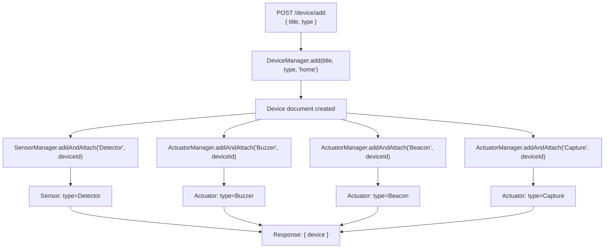
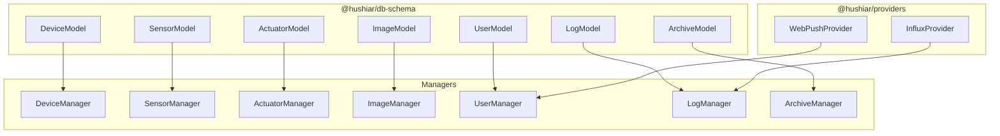

# admin-api — @hushiar/admin-api

Internal admin dashboard API running on **port 4004**. Provides read/write access to all entities for administrative tooling. There is **no authentication middleware** — this service must not be exposed to the public internet.

---

## Table of Contents

- [Responsibilities](#responsibilities)
- [HTTP Routes](#http-routes)
- [addDevice Flow](#adddevice-flow)
- [Container Dependencies](#container-dependencies)
- [Environment Variables](#environment-variables)
- [Deployment Notes](#deployment-notes)

---

## Responsibilities

- Browse and manage devices, sensors, actuators, images, archives, logs, and users.
- Create new devices with default hardware configuration (Detector sensor + Buzzer, Beacon, Capture actuators).
- Download device MQTT credentials as a text file.
- No real-time or MQTT functionality — read/write operations only.

---

## HTTP Routes

### System

| Method | Path | Description |
|--------|------|-------------|
| `GET` | `/isAlive` | Health check — returns `{ message: "api.admin.hs is Alive!" }` |

### Device

| Method | Path | Body / Params | Description |
|--------|------|---------------|-------------|
| `GET` | `/device/getAll` | — | All devices across all users |
| `GET` | `/device/configList` | — | All devices, returns only `{ manufactureId, mqttUserName, mqttPassword }` per device |
| `GET` | `/device/configList_download` | — | Downloads a `config.txt` file with MQTT credentials for all devices |
| `POST` | `/device/add` | `{ title, type }` | Create device + attach default sensor (Detector) and actuators (Buzzer, Beacon, Capture). Returns `{ device }` |

### Sensor

| Method | Path | Description |
|--------|------|-------------|
| `GET` | `/sensor/add` | Hardcoded test stub — creates a sensor with `type=Detector, status=InStock`. Returns `{ sensor }` |

### Actuator

| Method | Path | Description |
|--------|------|-------------|
| `GET` | `/actuator/add` | Hardcoded test stub — creates an actuator with `type=Alarm, status=InStock`. Returns `{ actuator }` |

### Image

| Method | Path | Params | Description |
|--------|------|--------|-------------|
| `GET` | `/image/getAll` | — | All images sorted by `registerDate` descending. Returns `{ imageList }` |
| `GET` | `/image/getAll_device/:deviceId` | `deviceId` (URL param) | Returns HTML page with `` tags for all images belonging to a device |

### Log

| Method | Path | Body | Description |
|--------|------|------|-------------|
| `POST` | `/log/removeAllByDevice` | `{ deviceId }` | Delete all logs for a device. Returns `{ status: "done" }` |

### Archive

| Method | Path | Body | Description |
|--------|------|------|-------------|
| `POST` | `/archive/removeAllByDevice` | `{ deviceId }` | Delete all archives for a device. Returns `{ status: "done" }` |

### User

| Method | Path | Body | Description |
|--------|------|------|-------------|
| `GET` | `/user/getAll` | — | All users. Returns `{ userList }` |
| `POST` | `/user/notifyTest` | `{ userId }` | Sends a test web push notification to the user. Returns `{ result: "ok" }` |

---

## addDevice Flow

`POST /device/add` creates a fully configured device in one call:

---

## Container Dependencies

---

## Environment Variables

| Variable | Required | Default | Description |
|----------|----------|---------|-------------|
| `MONGO_URI` | No | `mongodb://localhost:27017/hushiar` | MongoDB connection string |
| `VAPID_PUBLIC_KEY` | Yes | — | VAPID public key for web push notifications |
| `VAPID_PRIVATE_KEY` | Yes | — | VAPID private key for web push notifications |
| `VAPID_EMAIL` | No | `admin@hushiar.com` | VAPID subject email |
| `INFLUX_URL` | No | `""` | InfluxDB server URL |
| `INFLUX_TOKEN` | No | `""` | InfluxDB auth token |
| `INFLUX_ORG` | No | `""` | InfluxDB organization |
| `INFLUX_BUCKET` | No | `""` | InfluxDB bucket name |

---

## Deployment Notes

- **No authentication.** Bind this service to `127.0.0.1` only, or place it behind a firewall / VPN. Never expose port 4004 publicly.
- No Socket.io, no MQTT — this service has no real-time components.
