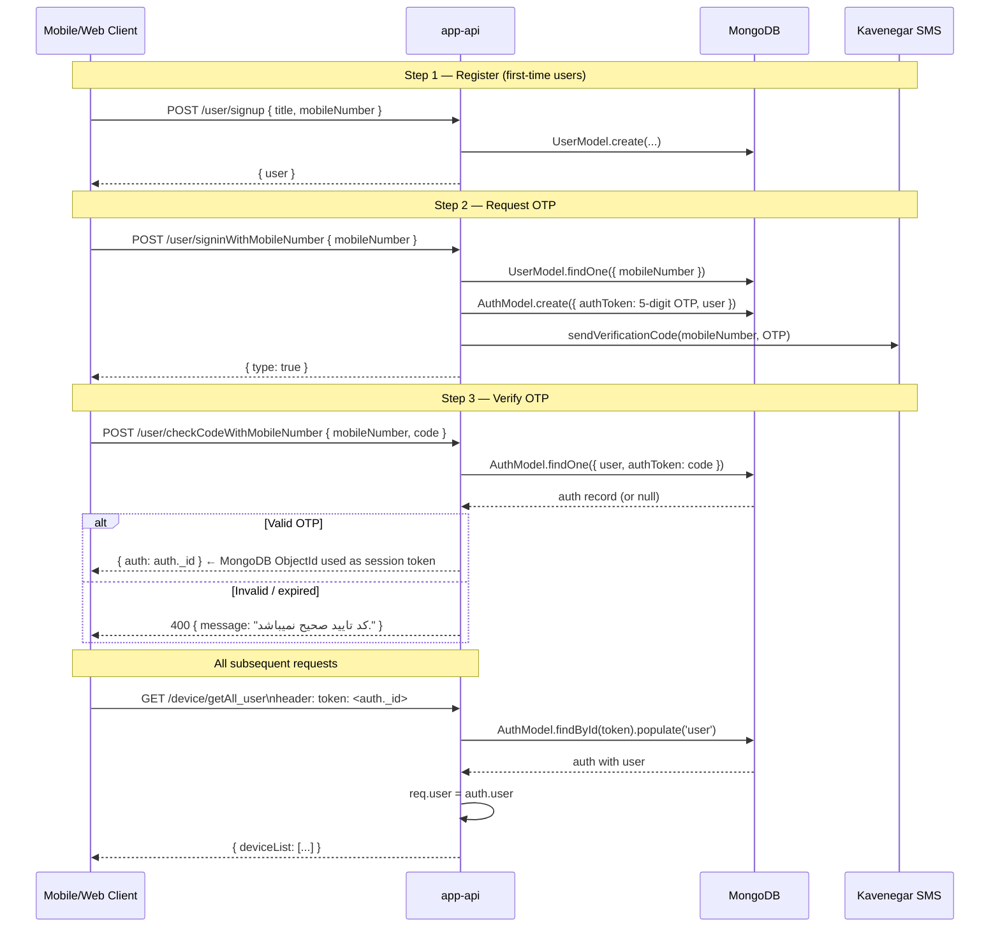
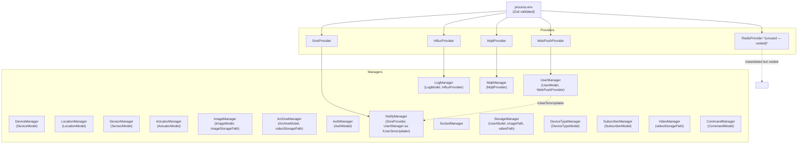

# app-api — @hushiar/app-api

Main user-facing service running on **port 4001**. Provides the full REST API consumed by mobile and web clients, a Socket.io channel for real-time device events, and a cron-based scheduler that archives images into videos.

---

## Table of Contents

- [Responsibilities](#responsibilities)
- [HTTP Routes](#http-routes)
- [Authentication Flow](#authentication-flow)
- [Socket.io Events](#socketio-events)
- [Scheduler](#scheduler)
- [MQTT Integration](#mqtt-integration)
- [Container Dependencies](#container-dependencies)
- [Environment Variables](#environment-variables)

---

## Responsibilities

1. **User auth** — Mobile-number OTP login via Kavenegar SMS; session tokens stored in MongoDB.
2. **Device management** — Status changes (home/silentMonitoring/secureMonitoring), alarm toggling, sensor/actuator control dispatched over MQTT.
3. **Real-time events** — Socket.io pushes new logs and archive records to the authenticated user's browser/app.
4. **Archive scheduler** — Croner job assembles JPEG frames into MP4 archives every `ARCHIVE_VIDEO_DURATION_MIN` minutes.
5. **Storage reconciliation** — Hourly croner job recalculates disk usage per user.
6. **Subscription deduction** — Daily croner job at 10:50 decrements `user.remainingDays`.

---

## HTTP Routes

Most routes require the `token` header (a MongoDB ObjectId string matching an `Auth` document). Exceptions that do **not** require auth:

- `POST /user/signup`
- `POST /user/signinWithMobileNumber`
- `POST /user/checkCodeWithMobileNumber`
- `GET /actuator/getStream`
- `GET /isAlive`

### Auth (no token required)

| Method | Path | Body | Description |
|--------|------|------|-------------|
| `POST` | `/user/signup` | `{ title, mobileNumber }` | Create a new user account |
| `POST` | `/user/signinWithMobileNumber` | `{ mobileNumber }` | Send OTP via SMS |
| `POST` | `/user/checkCodeWithMobileNumber` | `{ mobileNumber, code }` | Verify OTP, return auth token |

### User

| Method | Path | Description |
|--------|------|-------------|
| `GET` | `/user/get` | Get current user profile |
| `POST` | `/user/updateInfo` | Update title / email |
| `POST` | `/user/subscribeWebPush` | Register browser push subscription |
| `POST` | `/user/increaseCredit` | Add credit to account |

### Device

| Method | Path | Headers | Description |
|--------|------|---------|-------------|
| `GET` | `/device/getAll_user` | — | All devices owned by the user |
| `GET` | `/device/get_user` | `deviceid` | Single device detail |
| `POST` | `/device/assignLocation` | — | Assign device to a location |
| `POST` | `/device/setAlarmStatus` | — | Set `isOnAlarm` true/false |
| `POST` | `/device/setIsMonitoring` | — | Toggle motion detection |
| `POST` | `/device/setup` | — | Initial device setup (title, type) |
| `POST` | `/device/setInfo` | — | Update device title/info |
| `POST` | `/device/setStatus` | — | Change status (`home`/`silentMonitoring`/`secureMonitoring`) — also pushes sensor/actuator states over MQTT |

### Sensor

| Method | Path | Headers | Description |
|--------|------|---------|-------------|
| `GET` | `/sensor/getAll_device` | `deviceid` | All sensors for a device |
| `POST` | `/sensor/isActive` | `deviceid`, `sensorid` | Toggle sensor active state + MQTT publish |

### Actuator

| Method | Path | Headers | Description |
|--------|------|---------|-------------|
| `GET` | `/actuator/getAll_device` | `deviceid` | All actuators for a device |
| `GET` | `/actuator/getImageList` | `deviceid`, `actuatorid` | Images captured by a Capture actuator |
| `GET` | `/actuator/getStream` | — *(no auth)* | Download `stream.mp4` from video storage |
| `GET` | `/actuator/getLastImage/:timeStamp` | `deviceid`, `actuatorid`, `currentimageid` | Get last captured image for an actuator |
| `POST` | `/actuator/isActive` | `deviceid`, `actuatorid` | Toggle actuator active state + MQTT publish |

### Image

| Method | Path | Headers | Description |
|--------|------|---------|-------------|
| `POST` | `/image/getAll_device` | `deviceid` | All images for a device |
| `GET` | `/image/get` | `deviceid`, `imageid` | Single image with base64 content |
| `POST` | `/image/delete` | `deviceid` | Delete image (DB + disk) |

### Archive

| Method | Path | Headers | Description |
|--------|------|---------|-------------|
| `GET` | `/archive/getAll_device` | `deviceid` | All archives for a device |
| `GET` | `/archive/getAll_user` | — | All archives across all user devices |
| `GET` | `/archive/getOne` | `archiveid` | Single archive detail |
| `POST` | `/archive/delete` | `deviceid` | Delete archive (DB + video file + images) |
| `GET` | `/video/:token/:archiveId` | — | Stream archive video file (URL params) |
| `GET` | `/video/getAll_device` | `deviceid` | All video archives for a device (with thumbnails) |

### Log

| Method | Path | Headers | Description |
|--------|------|---------|-------------|
| `GET` | `/log/getAll_device` | `deviceid` | Logs for a device |
| `GET` | `/log/getAll_user` | — | Logs across all user devices |

### Location

| Method | Path | Description |
|--------|------|-------------|
| `GET` | `/location/getAll` | All locations for the user |
| `POST` | `/location/add` | Create a named location |

### Subscriber

| Method | Path | Description |
|--------|------|-------------|
| `POST` | `/subscriber/add` | Add SMS subscriber to a device |
| `GET` | `/subscriber/getAll_device` | List subscribers for a device (requires `deviceid` header) |
| `POST` | `/subscriber/remove` | Remove a subscriber |

### Device Type

| Method | Path | Description |
|--------|------|-------------|
| `GET` | `/deviceType/getAll` | List all device type catalog entries |

### System

| Method | Path | Description |
|--------|------|-------------|
| `GET` | `/isAlive` | Health check — returns `{ message: "api.app.hs is Alive!" }` |
| `GET` | `/socket/getAll` | List active Socket.io connections (auth required) |

---

## Authentication Flow



---

## Socket.io Events

### Connection Auth

```
ws://host:4001?token=<auth._id>
```

The Socket.io auth middleware validates the `token` query parameter against the `Auth` collection. Invalid tokens receive `Error('Access Denied')` and the connection is closed.

### Connection Lifecycle

```typescript
io.on('connection', (socket) => {
  socketManager.onConnect(socket);  // one socket per userId — replaces any previous
  socket.on('disconnect', () => socketManager.onDisconnect(socket));
});
```

### Events emitted by the server

| Event | Payload | When |
|-------|---------|------|
| `newLog` | `{ deviceId, log }` | After image archive or video generation |

---

## Scheduler

Three croner jobs started at app launch via `startScheduler()` in `src/scheduler.ts`:

```mermaid
gantt
    title Scheduler Jobs (24-hour view)
    dateFormat HH:mm
    axisFormat %H:%M

    section Archive Images
    Every N min (ARCHIVE_VIDEO_DURATION_MIN) :active, 00:00, 24:00

    section Storage Reconciliation
    Every hour (at :00) :active, 00:00, 24:00

    section Deduct Remaining Days
    Daily at 10:50 :milestone, 10:50, 1m
```



| Job | Cron expression | Action |
|-----|----------------|--------|
| `archiveImages` | `*/${ARCHIVE_VIDEO_DURATION_MIN} * * * *` | For each device: query images in the last N minutes → generate MP4 → save archive record → emit `newLog` via Socket.io |
| `deductRemainingDays` | `50 10 * * *` | `userManager.deductRemainingDays()` for all users via `Promise.allSettled` |
| `storageReconciliation` | `0 * * * *` | `storageManager.reconcileStorage()` — scans disk and updates `storageUsedSize` |

Jobs are stopped gracefully on `SIGTERM` before the process exits.

---

## MQTT Integration

`app-api` connects to the MQTT broker to send **commands to devices**. It does not process incoming device telemetry (that's `device-api`'s job).

Commands sent:

| When | MQTT publish |
|------|-------------|
| `POST /device/setStatus` | `HSHYR_{token}/sub/{sensorType}` + `HSHYR_{token}/sub/{actuatorType}` for all device sensors/actuators |
| `POST /sensor/isActive` | `HSHYR_{token}/sub/{sensorType}` with `"1"` or `"0"` |
| `POST /actuator/isActive` | `HSHYR_{token}/sub/{actuatorType}` with `"1"` or `"0"` |

---

## Container Dependencies



---

## Environment Variables

All variables from the root `.env.example` are required. The container uses Zod to validate on startup and exits with a clear error if any required variable is missing.

| Variable | Description |
|----------|-------------|
| `MONGO_URI` | MongoDB connection string |
| `REDIS_HOST` / `REDIS_PORT` | Redis for caching |
| `INFLUX_*` | InfluxDB time-series |
| `VAPID_*` | Web Push VAPID keys |
| `KAVENEGAR_API_KEY` | SMS OTP provider |
| `HUSHIAR_MQTT_*` | MQTT broker credentials |
| `MQTT_PASSWORD_ENCRYPTION_KEY` | *(optional)* AES-256 key for device credentials |
| `CAMERA_IMAGE_STORAGE_PATH` | *(optional)* JPEG storage root |
| `CAMERA_VIDEO_STORAGE_PATH` | *(optional)* MP4 storage root |
| `ARCHIVE_VIDEO_DURATION_MIN` | *(optional)* Archive interval in minutes (default: `1`) |
