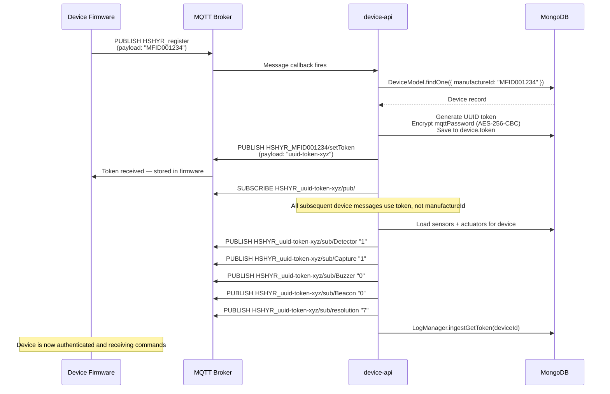
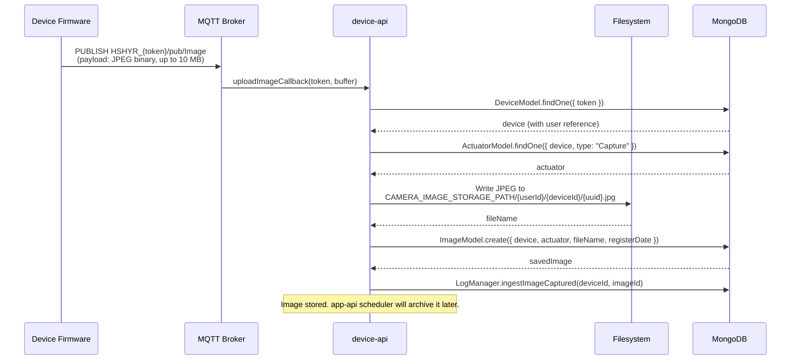
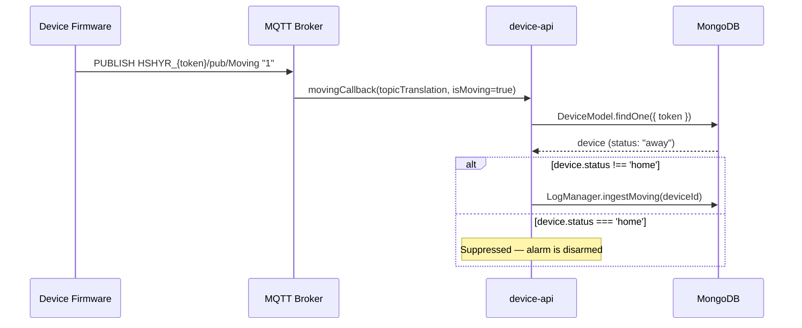
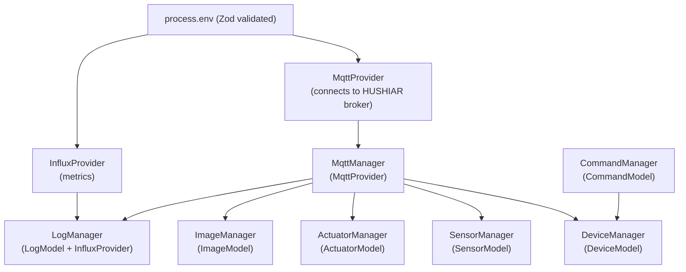

# device-api — @hushiar/device-api

Device-facing HTTP + MQTT bridge running on **port 4003**. Every physical camera and sensor communicates exclusively through this service — either over MQTT (telemetry and commands) or over HTTP (registration handshake).

> **Hardware contract.** Topic strings and endpoint paths in this file are hardcoded in device firmware. Changes to them break physical devices in the field with no compile-time warning.

---

## Table of Contents

- [Responsibilities](#responsibilities)
- [MQTT Protocol Reference](#mqtt-protocol-reference)
- [Device Registration Flow](#device-registration-flow)
- [Image Upload Flow](#image-upload-flow)
- [Motion Detection Flow](#motion-detection-flow)
- [HTTP Routes](#http-routes)
- [Device Auth Middleware](#device-auth-middleware)
- [Container Dependencies](#container-dependencies)
- [Deployment & Graceful Shutdown](#deployment--graceful-shutdown)
- [Environment Variables](#environment-variables)

---

## Responsibilities

1. **Registration** — Devices send their `manufactureId` over MQTT on boot; the server responds with a rotating auth token and MQTT broker URL.
2. **Image ingestion** — Devices stream JPEG frames over MQTT; server stores to disk and creates database records.
3. **Motion events** — PIR sensor publishes `"1"` / `"0"` payloads; server logs motion events.
4. **Command dispatch** — Server publishes actuator commands (enable Capture, Buzzer, Beacon; set resolution) to device-specific subscribe topics.
5. **HTTP endpoints** — Sensor/actuator attachment, heartbeat, on-alarm state — protected by `devicemanufactureid` header auth.

---

## MQTT Protocol Reference

The MQTT bridge is set up in `src/container.ts` via callbacks registered on `MqttManager`. The MqttManager (from `@hushiar/core`) calls these callbacks when matching messages arrive.

### Topics consumed by this service

| Topic | Payload | Action |
|-------|---------|--------|
| `HSHYR_register` | `<manufactureId>` (UTF-8) | Generate token, subscribe device, push setToken |
| `HSHYR_<token>/pub/Image` | Raw JPEG binary | Store image to disk + DB |
| `HSHYR_<token>/pub/Moving` | `"1"` \| `"0"` | Log motion event if device is not in `home` mode |
| `HSHYR_<token>/pub/Detector` | `"1"` \| `"0"` | Log sensor action |
| `HSHYR_<token>/pub/Capture` | `"1"` \| `"0"` | Log actuator action |
| `HSHYR_<token>/pub/Buzzer` | `"1"` \| `"0"` | Log actuator action |
| `HSHYR_<token>/pub/Beacon` | `"1"` \| `"0"` | Log actuator action |

> **Note:** Only Register, Image, and Moving have registered MQTT callbacks in `src/container.ts`. Detector, Capture, Buzzer, and Beacon topics are defined in the MqttManager's topic map but no callbacks are wired — the device publishes on them but this service does not currently process those messages.

### Topics published by this service

| Topic | Payload | When |
|-------|---------|------|
| `HSHYR_<manufactureId>/setToken` | token string | After successful registration |
| `HSHYR_<token>/sub/Detector` | `"1"` \| `"0"` | After registration — push current sensor isActive state |
| `HSHYR_<token>/sub/Capture` | `"1"` \| `"0"` | After registration — push current actuator isActive state |
| `HSHYR_<token>/sub/Buzzer` | `"1"` \| `"0"` | After registration — push current actuator isActive state |
| `HSHYR_<token>/sub/Beacon` | `"1"` \| `"0"` | After registration — push current actuator isActive state |
| `HSHYR_<token>/sub/resolution` | `"7"` | After registration — default resolution |

---

## Device Registration Flow

This is the critical boot sequence every physical device goes through.



The same flow is triggered by HTTP `GET /register/:manufactureId` — identical logic, different transport.

---

## Image Upload Flow



---

## Motion Detection Flow



---

## HTTP Routes

### Public (no auth)

| Method | Path | Description |
|--------|------|-------------|
| `GET` | `/isAlive` | Health check — returns `{ message: "api.device.hs is Alive!" }` |
| `GET` | `/register/:manufactureId` | Device token handshake (same logic as MQTT register) |
| `POST` | `/device/heartBeat` | Device keepalive ping — returns `{ type: true }` |

### Protected (requires `devicemanufactureid` header)

| Method | Path | Description |
|--------|------|-------------|
| `GET` | `/sensor/attached` | Attach a sensor (`?sensorManufactureId=`) to the device |
| `GET` | `/sensor/detach` | Detach a sensor (`?sensorManufactureId=`) from the device |
| `GET` | `/actuator/attached` | Attach an actuator (`?actuatorManufactureId=`) to the device |
| `POST` | `/upload/image` | HTTP image upload (multer, max 10 MB, JPEG/PNG/WebP) |
| `POST` | `/device/onAlarm` | Set device on-alarm state (body: `{ isOnAlarm }`) |
| `GET` | `/device/getAllCommand` | Poll for pending commands |
| `POST` | `/device/commandExecuteResult` | Confirm command execution (body: `{ commandId, isDone }`) |
| `POST` | `/device/ingestLog` | Ingest a device log entry (body: `{ data }`) |
| `POST` | `/device/ingetLog` | Firmware typo alias for `/device/ingestLog` (backward compat) |

---

## Device Auth Middleware

`src/middleware/deviceAuth.ts` guards all routes below the `/register` and `/heartBeat` mounts.

```
Request
  │
  ├─ missing 'devicemanufactureid' header → 403 { message: "Missing devicemanufactureid header" }
  │
  ├─ DeviceModel.findOne({ manufactureId }) → null → 403 { message: "Device not found" }
  │
  └─ device found → req.device = device → next()
```

The `devicemanufactureid` header must contain the hardware manufacture ID (not the rotating token). This ID is burned into firmware at manufacture time and never changes.

---

## Container Dependencies



`CommandManager` is used by the protected device routes (`GET /device/getAllCommand`, `POST /device/commandExecuteResult`) to poll and confirm queued actuator commands. It is not involved in any MQTT callback.

`src/app.ts` contains the Express app factory (`createApp`) — it wires middleware (JSON parser, CORS, device auth) and mounts all route factories onto the app.

MQTT callbacks registered in `src/container.ts`:
- `setRegisterDeviceCallback` — runs the full token registration sequence
- `setUploadImageCallback` — stores image to disk and DB
- `setMovingCallback` — logs motion events when not in home mode

---

## Deployment & Graceful Shutdown

`src/index.ts` registers a `SIGTERM` handler for clean container shutdown:

```typescript
process.on('SIGTERM', async () => {
  await container.mqttProvider.disconnect().catch(console.error);
  await mongoose.disconnect();
  process.exit(0);
});
```

On `SIGTERM` (sent by Docker, Kubernetes, or PM2 on stop/redeploy):

1. **MqttProvider.disconnect()** — gracefully closes the MQTT broker connection (in-flight messages complete before disconnect).
2. **mongoose.disconnect()** — closes all MongoDB connection pools.
3. **process.exit(0)** — exits cleanly.

> There is no `SIGINT` handler — during development the process simply terminates, which is fine because MQTT and MongoDB connections are cleaned up by their own driver-level shutdown hooks.

---

## Environment Variables

| Variable | Required | Description |
|----------|----------|-------------|
| `HUSHIAR_MQTT_HOST` | Yes | MQTT broker hostname |
| `HUSHIAR_MQTT_PORT` | Yes | MQTT broker port |
| `HUSHIAR_MQTT_USERNAME` | Yes | MQTT broker username |
| `HUSHIAR_MQTT_PASSWORD` | Yes | MQTT broker password |
| `INFLUX_URL` | Yes | InfluxDB URL |
| `INFLUX_TOKEN` | Yes | InfluxDB API token |
| `INFLUX_ORG` | Yes | InfluxDB organisation |
| `INFLUX_BUCKET` | Yes | InfluxDB bucket |

> **Note:** MongoDB connection is handled implicitly by `@hushiar/db-schema` `connect()` (reads `MONGO_URI` from environment).
