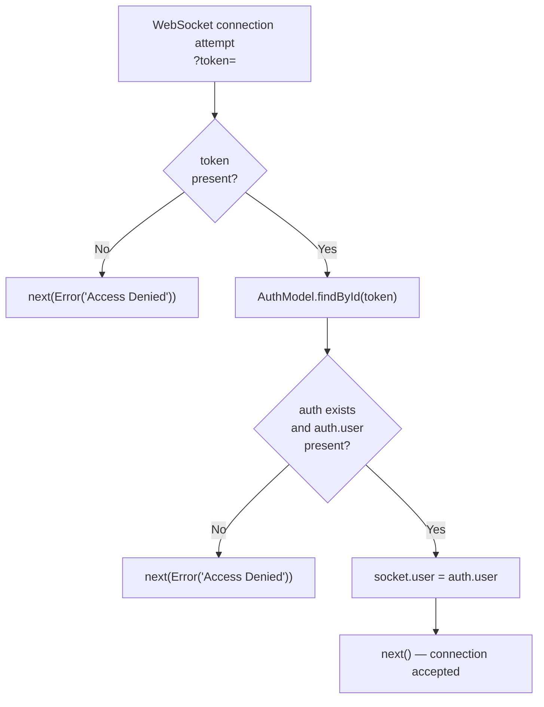
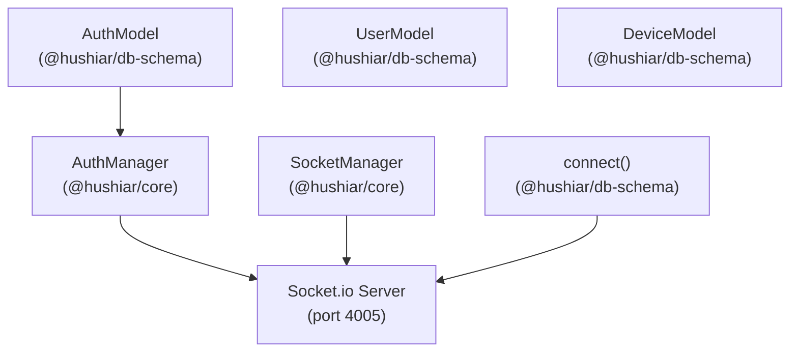

# live-api — @hushiar/live-api

Socket.io relay server running on **port 4005**. Provides a dedicated WebSocket endpoint for clients that need real-time device events without going through the main `app-api` process.

---

## Table of Contents

- [Purpose](#purpose)
- [File Structure](#file-structure)
- [Routes](#routes)
- [Connection and Auth](#connection-and-auth)
- [Socket Lifecycle](#socket-lifecycle)
- [Events](#events)
- [Dependencies](#dependencies)
- [Environment Variables](#environment-variables)
- [Graceful Shutdown](#graceful-shutdown)
- [When to Use This vs app-api](#when-to-use-this-vs-app-api)

---

## Purpose

`live-api` shares the same `SocketManager` concept as `app-api` but runs as an independent process. This is useful when:

- `app-api` is under high HTTP load and you want to isolate WebSocket traffic.
- You want to horizontally scale the Socket.io tier separately from the REST API tier.

The business logic for what _to emit_ (new archive logs, motion alerts) lives in `app-api`'s scheduler and MQTT callbacks. `live-api` is a pure relay — it manages connections and delivers events that other services push through the shared `SocketManager`.

---

## File Structure

`live-api` is a single-file implementation with no route factory or middleware modules:

```
apps/live-api/
├── src/
│   └── index.ts          ← Express app, Socket.io server, auth middleware, lifecycle
├── package.json
└── tsconfig.json
```

There is no `container.ts`, `routes/`, or `middleware/` directory. Everything is wired directly in `src/index.ts`.

---

## Routes

### System

| Method | Path | Response | Description |
|--------|------|----------|-------------|
| GET | `/isAlive` | `{ message: "api.live.hs is Alive!" }` | Health check |

---

## Connection and Auth

```
ws://host:4005?token=<auth._id>
```

The `token` query parameter must be a MongoDB ObjectId string matching a valid `Auth` document. The Socket.io auth middleware:



---

## Socket Lifecycle

```typescript
io.on('connection', (socket) => {
  socketManager.onConnect(socket);          // registers user → socket mapping
  socket.on('disconnect', () => {
    socketManager.onDisconnect(socket);     // removes mapping
  });
});
```

Only one socket per user is tracked at a time. A new connection for the same user replaces the previous one.

---

## Events

The table below describes the **protocol** — events that a connected client can expect to receive. These events are **not emitted by `live-api` itself**; they are emitted by other services (e.g., `app-api`) that share the same `SocketManager` class. A client connected to `live-api` will only receive events if the emitting service targets the same `SocketManager` instance.

| Event | Payload | Description |
|-------|---------|-------------|
| `newLog` | `{ deviceId, log }` | New log entry (archive, motion, token request) |
| `deviceStatus` | `{ deviceId, status }` | Device alarm status change |

---

## Dependencies



`AuthManager` is instantiated directly in `src/index.ts` (no DI container). `UserModel` and `DeviceModel` are imported from `@hushiar/db-schema` (available for future use). `SocketManager` has no constructor dependencies — it maintains an in-memory map of `userId → Socket`.

---

## Environment Variables

| Variable | Required | Description |
|----------|----------|-------------|
| `MONGO_URI` | Yes | MongoDB connection string (required by `@hushiar/db-schema` `connect()`) |
| `PORT` | No | Hardcoded to `4005` — not currently configurable via env |

---

## Graceful Shutdown

On `SIGTERM`, `live-api`:

1. Closes the Socket.io server (`io.close()`) — disconnects all connected clients.
2. Disconnects from MongoDB (`mongoose.disconnect()`).
3. Exits with code `0`.

---

## When to Use This vs app-api

| Scenario | Use |
|----------|-----|
| Simple single-server deployment | `app-api` Socket.io (port 4001) is sufficient |
| Separate WebSocket scaling | Connect clients to `live-api` (port 4005) for Socket.io only |
| REST API calls | Always use `app-api` (port 4001) |

If both are running, each maintains its own independent `SocketManager` instance. A `socketManager.emit()` in `app-api` will not reach sockets connected to `live-api`. For shared state across processes, a Redis adapter for Socket.io would be needed (not currently implemented).
