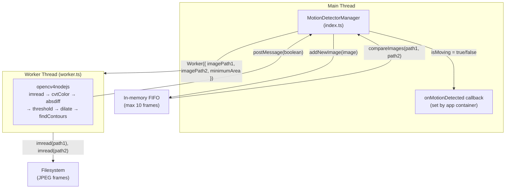
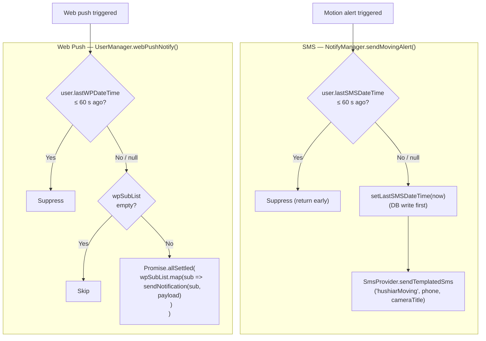
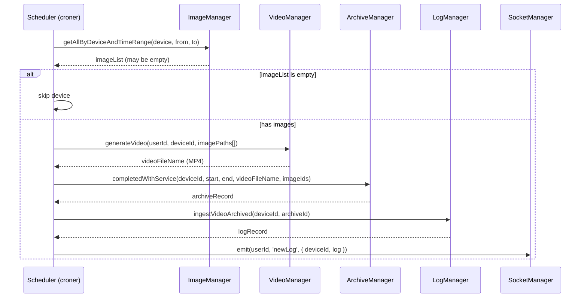

# @hushiar/core

Twenty-one manager classes encapsulating all business logic. Apps import managers from this package and wire them together in their own `container.ts`. Managers do not know about Express, Socket.io, or MQTT topology — they receive typed dependencies through constructors.

---

## Table of Contents

- [Manager Catalogue](#manager-catalogue)
- [Constructor Dependency Graph](#constructor-dependency-graph)
- [Key Flows](#key-flows)
  - [Motion Detection Pipeline](#motion-detection-pipeline)
  - [SMS and Web Push Notifications](#sms-and-web-push-notifications)
  - [Archive Pipeline](#archive-pipeline)
  - [Device Registration](#device-registration)
- [Design Notes](#design-notes)

---

## Manager Catalogue

| Manager | File | Constructor args | Responsibility |
|---------|------|-----------------|----------------|
| `UserManager` | `managers/user/` | `UserModel, WebPushProvider` | User CRUD, web push fan-out, throttled notifications, subscription management, credit/day deductions |
| `DeviceManager` | `managers/device/` | `DeviceModel` | Device CRUD, token rotation, AES-256-CBC password encryption/decryption, alarm and monitoring state |
| `LocationManager` | `managers/location/` | `LocationModel` | Per-user named location CRUD |
| `SensorManager` | `managers/sensor/` | `SensorModel` | Sensor CRUD, attach/detach to devices |
| `ActuatorManager` | `managers/actuator/` | `ActuatorModel` | Actuator CRUD, add-and-attach/assign to devices |
| `ImageManager` | `managers/image/` | `ImageModel, storagePath?` | Disk I/O for JPEG frames, DB record management, in-memory last-image cache |
| `ArchiveManager` | `managers/archive/` | `ArchiveModel, videoPath?` | Archive lifecycle: open → fill → close with video reference |
| `LogManager` | `managers/log/` | `LogModel, InfluxProvider` | Ingest domain events to MongoDB + InfluxDB time-series |
| `CommandManager` | `managers/command/` | `CommandModel` | Pending device commands — create, set execution result, query by status |
| `AuthManager` | `managers/auth/` | `AuthModel` | Auth token creation, lookup, revocation |
| `NotifyManager` | `managers/notify/` | `SmsProvider, IUserSmsUpdater` | SMS OTP and motion alerts with 60 s throttle |
| `SocketManager` | `managers/socket/` | *(none)* | Socket.io connection registry — one socket per user, emit by userId |
| `MqttManager` | `managers/mqtt/` | `MqttProvider` | MQTT dispatch: register/uploadImage/moving/action callbacks; publish setToken/setStatus/setResolution; subscribeDeviceTopic for per-device MQTT topics |
| `StorageManager` | `managers/storage/` | `UserModel, imagePath?, videoPath?` | Disk usage scanning via `fast-folder-size`, incremental `$inc` updates |
| `VideoManager` | `managers/video/` | `storagePath?` | `videoshow` wrapper — assembles JPEG list into MP4 |
| `DeviceTypeManager` | `managers/device-type/` | `DeviceTypeModel` | Device type catalog read-only access |
| `SubscriberManager` | `managers/subscriber/` | `SubscriberModel` | SMS subscriber CRUD per device |
| `VerboseManager` | `managers/verbose/` | `VerboseModel` | Debug log ingestion |
| `InfluxManager` | `managers/influx/` | `InfluxProvider` | Thin delegate for direct InfluxDB writes |
| `MemStorageManager` | `managers/mem-storage/` | `RedisProvider` | Redis-backed last-image-per-device cache (separate from ImageManager's in-process cache) |
| `MotionDetectorManager` | `managers/motion-detector/` | `storagePath?, monitoringDurationSecond?` | OpenCV motion detection in a worker thread; bounded image FIFO |

---

## Constructor Dependency Graph

```mermaid
graph TD
    subgraph Models["@hushiar/db-schema models"]
        UM_M["UserModel"]
        DM_M["DeviceModel"]
        LM_M["LocationModel"]
        SM_M["SensorModel"]
        AM_M["ActuatorModel"]
        IM_M["ImageModel"]
        AR_M["ArchiveModel"]
        LG_M["LogModel"]
        CM_M["CommandModel"]
        AU_M["AuthModel"]
        DT_M["DeviceTypeModel"]
        SB_M["SubscriberModel"]
        VM_M["VerboseModel"]
    end

    subgraph Providers["@hushiar/providers"]
        RP["RedisProvider"]
        IP["InfluxProvider"]
        MP["MqttProvider"]
        SP["SmsProvider"]
        WP["WebPushProvider"]
    end

    subgraph Managers["@hushiar/core managers"]
        UserMgr["UserManager"]
        DevMgr["DeviceManager"]
        LocMgr["LocationManager"]
        SenMgr["SensorManager"]
        ActMgr["ActuatorManager"]
        ImgMgr["ImageManager"]
        ArcMgr["ArchiveManager"]
        LogMgr["LogManager"]
        CmdMgr["CommandManager"]
        AuthMgr["AuthManager"]
        NotMgr["NotifyManager"]
        SktMgr["SocketManager"]
        MqtMgr["MqttManager"]
        StoMgr["StorageManager"]
        VidMgr["VideoManager"]
        DTMgr["DeviceTypeManager"]
        SubMgr["SubscriberManager"]
        MotMgr["MotionDetectorManager"]
        MemMgr["MemStorageManager"]
        VMgr["VerboseManager"]
        IMgr["InfluxManager"]
    end

    UM_M --> UserMgr
    WP  --> UserMgr

    DM_M --> DevMgr

    LM_M --> LocMgr
    SM_M --> SenMgr
    AM_M --> ActMgr

    IM_M --> ImgMgr
    AR_M --> ArcMgr

    LG_M --> LogMgr
    IP   --> LogMgr

    CM_M --> CmdMgr
    AU_M --> AuthMgr

    SP   --> NotMgr
    UserMgr -. "IUserSmsUpdater\n(setLastSMSDateTime)" .-> NotMgr

    MP   --> MqtMgr

    UM_M --> StoMgr

    RP   --> MemMgr

    DT_M --> DTMgr
    SB_M --> SubMgr

    VM_M["VerboseModel"] --> VMgr["VerboseManager"]
    IP   --> IMgr["InfluxManager"]
```



`NotifyManager` receives `UserManager` as `IUserSmsUpdater` (a single-method interface) to avoid a circular dependency.

---

## Key Flows

### Motion Detection Pipeline

Motion detection runs OpenCV in a dedicated worker thread so the event loop is never blocked during image processing.



The FIFO buffer is capped at `MAX_MEMORY_IMAGES = 10` frames to prevent OOM when multiple devices send images concurrently. Oldest frames are evicted first by timestamp, then by count if the time window cap is still exceeded.

If `opencv4nodejs` is not installed, the worker catches the import error and posts `false` — motion detection is silently disabled.

### SMS and Web Push Notifications

Both notification channels enforce a 60-second throttle per user.



The DB timestamp is written **before** the SMS call — this prevents double-sending if two concurrent requests both check the throttle at the same millisecond.

`null` or `undefined` `lastSMSDateTime` / `lastWPDateTime` is treated as "never sent" and always allows the first notification through.

### Archive Pipeline

The scheduler in `app-api` runs this pipeline every `ARCHIVE_VIDEO_DURATION_MIN` minutes:



### Device Registration

See [`apps/device-api/README.md`](../../apps/device-api/README.md#device-registration-flow) for the full sequence diagram. The `DeviceManager` side:

```typescript
async registerDeviceToken(manufactureId: string): Promise<{ token: string; mqttBroker: string } | null>
```

1. Generates a UUID v4 token.
2. Finds the device by `manufactureId` and saves the token.
3. Returns `{ token, mqttBroker }` (broker from `HUSHIAR_MQTT_HOST` env) for the caller to push to the device.

---

## Design Notes

### Utilities as imports, not constructor args

Node.js builtins (`fs/promises`, `crypto`, `worker_threads`) and third-party utilities (`uuid`, `videoshow`, `fast-folder-size`) are imported directly inside each manager. They are not injected through constructors. This keeps constructors clean and makes the dependency graph explicit at the class level.

### `IUserSmsUpdater` — thin interface for NotifyManager

`NotifyManager` needs to write `user.lastSMSDateTime` but injecting the full `UserManager` would create a circular dependency (UserManager → NotifyManager → UserManager). The `IUserSmsUpdater` interface exposes only `setLastSMSDateTime()`, breaking the cycle.

### `storage.manager.ts` — incremental updates

`updateStorageUsage(userId, deltaMB)` uses MongoDB `$inc` to update disk usage atomically when an image is saved or deleted — no full scan needed. `reconcileStorage()` (hourly cron) is a correction pass that heals any drift from crashes or missed increments.

### `fast-folder-size` wrapping

The legacy code used `throw err` inside a `new Promise()` callback — in an async callback, `throw` does not reject the outer promise. The TypeScript port wraps `fastFolderSize` with `util.promisify()` and uses `async/await` with `try/catch`.

### Socket connection deduplication

`SocketManager.onConnect()` replaces any existing socket for the same `user._id`. Only one live socket per user is tracked. This prevents stale connections from accumulating when a user refreshes their browser.
