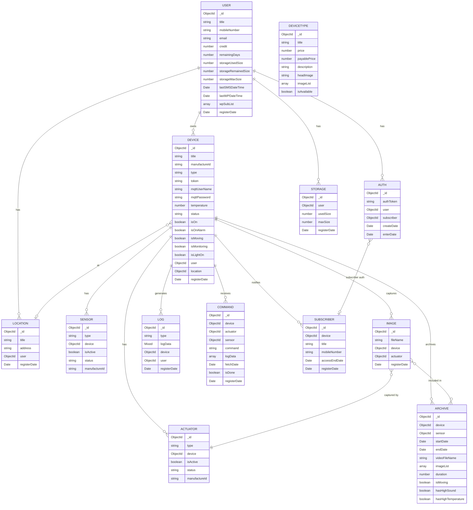

# @hushiar/db-schema

Mongoose 8 schemas, typed models, and the MongoDB connection helper. All other packages and apps import models from here — never from `mongoose` directly.

---

## Table of Contents

- [Usage](#usage)
- [Schema Catalogue](#schema-catalogue)
- [Entity Relationship Diagram](#entity-relationship-diagram)
- [Field-Level Notes](#field-level-notes)
- [Connection Management](#connection-management)

---

## Usage

```typescript
import { connect, disconnect } from '@hushiar/db-schema';
import { UserModel, DeviceModel, ImageModel } from '@hushiar/db-schema';

await connect(); // reads MONGO_URI from process.env
```

Each exported model is typed with an `IDoc` interface (the document shape from `@hushiar/shared-types`) and an `IModel` interface (adding static query helpers where needed).

---

## Schema Catalogue

| Export | Collection | Source interface |
|--------|------------|-----------------|
| `UserModel` | `users` | `IUser` |
| `DeviceModel` | `devices` | `IDevice` |
| `LocationModel` | `locations` | `ILocation` |
| `SensorModel` | `sensors` | `ISensor` |
| `ActuatorModel` | `actuators` | `IActuator` |
| `ImageModel` | `images` | `IImage` |
| `ArchiveModel` | `archives` | `IArchive` |
| `LogModel` | `logs` | `ILog` |
| `CommandModel` | `commands` | `ICommand` |
| `AuthModel` | `auths` | `IAuth` |
| `DeviceTypeModel` | `devicetypes` | `IDeviceType` |
| `SubscriberModel` | `subscribers` | `ISubscriber` |
| `VerboseModel` | `verboses` | `IVerbose` |
| `StorageModel` | `storages` | `IStorage` |

---

## Entity Relationship Diagram



---

## Field-Level Notes

### Typo corrections from legacy code

All field names below were renamed during the TypeScript migration. The old names are **not** in the schemas — if you see them in old client code, update the client.

| Legacy (wrong) | Corrected | Schema |
|---------------|-----------|--------|
| `remaningDays` | `remainingDays` | `users` |
| `temperture` | `temperature` | `devices` |
| `staus` (×2) | `status` | `sensors`, `actuators` |
| `hasHighTemperture` | `hasHighTemperature` | `archives` |
| `isAvaliable` | `isAvailable` | `devicetypes` |

### `devices.mqttPassword`

Stored AES-256-CBC encrypted. The encryption key is `MQTT_PASSWORD_ENCRYPTION_KEY`. Never store or log the plaintext value. Decryption happens inside `DeviceManager.decryptMqttPassword()`.

### `devices.status`

Three conventional alarm modes (these are **not** enforced by the schema — `status` is a plain `String` with no `enum` constraint):

| Value | Meaning |
|-------|---------|
| `'home'` | Alarm disarmed — motion events are not logged |
| `'silentMonitoring'` | Silent monitoring — device records without audible alerts |
| `'secureMonitoring'` | Secure monitoring — full alarm with alerts and logs |

### `auths.subscriber` / `auths.enterDate`

Optional fields. Auth records created for regular users do not set these — only subscriber auth records do.

### `archives.imageList`

Array of `ObjectId` references to `images`. The image documents are **not** deleted when an archive is created — they remain queryable individually.

---

## Connection Management

```typescript
// src/connection.ts
import mongoose from 'mongoose';

export async function connect(): Promise<void> {
  await mongoose.connect(process.env['MONGO_URI'] ?? 'mongodb://localhost:27017/hushiar');
}

export async function disconnect(): Promise<void> {
  await mongoose.disconnect();
}
```

`connect()` is called once at app startup. Each app registers a `SIGTERM` handler that calls `mongoose.disconnect()` before `process.exit(0)`.
