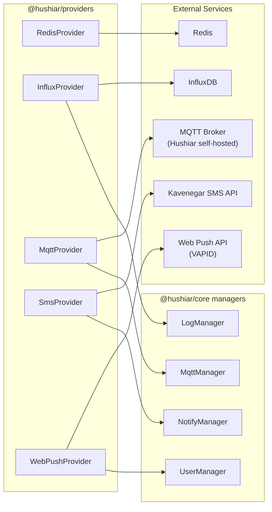

# @hushiar/providers

Thin wrappers around external service clients. Every provider is a class that reads its configuration from constructor arguments (which come from environment variables validated in each app's `container.ts`).

No provider connects at import time — connections happen in the constructor or on first use.

---

## Table of Contents

- [Provider Overview](#provider-overview)
- [RedisProvider](#redisprovider)
- [InfluxProvider](#influxprovider)
- [MqttProvider](#mqttprovider)
- [SmsProvider](#smsprovider)
- [WebPushProvider](#webpushprovider)

---

## Provider Overview



---

## RedisProvider

**Package dep:** `redis@4` (async API, explicit `.connect()`)

```typescript
class RedisProvider {
  constructor(url: string)  // e.g. "redis://127.0.0.1:6379" — calls createClient() only

  async connect(): Promise<void>    // must be called before any commands
  async disconnect(): Promise<void>
  async set(key: string, value: string, ttlSeconds?: number): Promise<void>
  async get(key: string): Promise<string | null>
}
```

The constructor only creates the client via `createClient()`. You **must call `connect()`** separately before issuing commands — the app's `container.ts` is responsible for awaiting it during startup.

**Environment:** `REDIS_HOST` + `REDIS_PORT` are read and composed into the URL in each app's `container.ts`.

---

## InfluxProvider

**Package dep:** `@influxdata/influxdb-client`

```typescript
import { Point } from '@influxdata/influxdb-client';  // re-exported from this package

class InfluxProvider {
  constructor(config: {
    url:    string;   // INFLUX_URL
    token:  string;   // INFLUX_TOKEN
    org:    string;   // INFLUX_ORG
    bucket: string;   // INFLUX_BUCKET
  })

  async writePoint(point: Point): Promise<void>
  async writeBoolean(measurement: string, deviceId: string, field: string, value: string): Promise<void>
  async writeString(measurement: string, deviceId: string, field: string, value: string): Promise<void>
}
```

`writeBoolean` and `writeString` are convenience methods that construct a `Point` with a `deviceId` tag and a string field, then delegate to `writePoint()`. The `Point` class is re-exported from `@influxdata/influxdb-client` for consumers that need to build custom points.

Each write opens a write API, writes the point, and closes the API (flushing immediately). Write errors propagate normally to the caller.

**Used by:** `LogManager` for time-series telemetry (motion events, image captures, video archives, token requests).

---

## MqttProvider

**Package dep:** `mqtt` (v5 client)

> Only the Hushiar self-hosted broker is supported. Public brokers (HiveMQ, EMQX) were removed — they carried device traffic in cleartext over shared infrastructure.

```typescript
class MqttProvider {
  constructor(config: {
    host:     string;   // HUSHIAR_MQTT_HOST
    port:     number;   // HUSHIAR_MQTT_PORT
    username: string;   // HUSHIAR_MQTT_USERNAME
    password: string;   // HUSHIAR_MQTT_PASSWORD
  })

  async subscribeToTopic(topic: string): Promise<void>
  async subscribeToTopicList(topics: string[]): Promise<void>
  async unsubscribeFromTopic(topic: string): Promise<void>
  setMessageCallback(fn: (topic: string, message: Buffer) => void): void
  publish(topic: string, message: string): void
  async disconnect(): Promise<void>
}
```

`setMessageCallback` replaces the client's `message` event listener. `MqttManager` in `@hushiar/core` is the only consumer; it registers its `handleSubscription` dispatcher as the callback.

**Bug fixed from legacy:** Legacy providers called `mqttClient.subscribe()` inside `unsubscribeToTopic()` — this is corrected to `mqttClient.unsubscribeAsync()` (mqtt v5 async API).

---

## SmsProvider

**Package dep:** `kavenegar` (Kavenegar REST API client)

```typescript
class SmsProvider {
  constructor(apiKey: string)  // KAVENEGAR_API_KEY

  async sendSms(sender: string, receptor: string, message: string): Promise<void>
  async sendTemplatedSms(template: string, receptor: string, token: string, token2?: string, token3?: string): Promise<void>
}
```

**Templates used:**

| Template name | When sent |
|--------------|-----------|
| `hushiarMoving` | Motion alert — `sendMovingAlert()` in `NotifyManager` |
| `hushiarVerification` | OTP verification — `sendVerificationCode()` in `NotifyManager` |

**Throttle:** `NotifyManager` enforces a 60-second minimum between SMS messages per user (checked via `user.lastSMSDateTime`). The timestamp is updated in the database before `sendTemplatedSms` is called to prevent double-sending under slow network conditions.

---

## WebPushProvider

**Package dep:** `web-push@3.6+`

```typescript
class WebPushProvider {
  constructor(config: {
    publicKey:  string;  // VAPID_PUBLIC_KEY
    privateKey: string;  // VAPID_PRIVATE_KEY
    email:      string;  // VAPID_EMAIL  (must be "mailto:...")
  })

  async sendNotification(
    subscription: WebPushSubscription,  // from @hushiar/shared-types
    payload: string
  ): Promise<void>
}
```

VAPID keys are set once at construction via `webpush.setVapidDetails()`.

**Used by:** `UserManager.webPushNotify()` which fans out to all subscriptions in `user.wpSubList` using `Promise.allSettled()` (one failing subscription does not abort the others).

**Throttle:** `UserManager` enforces a 60-second minimum between web push notifications per user (checked via `user.lastWPDateTime`). First-time recipients (`lastWPDateTime` is `null`) always receive the notification immediately.
