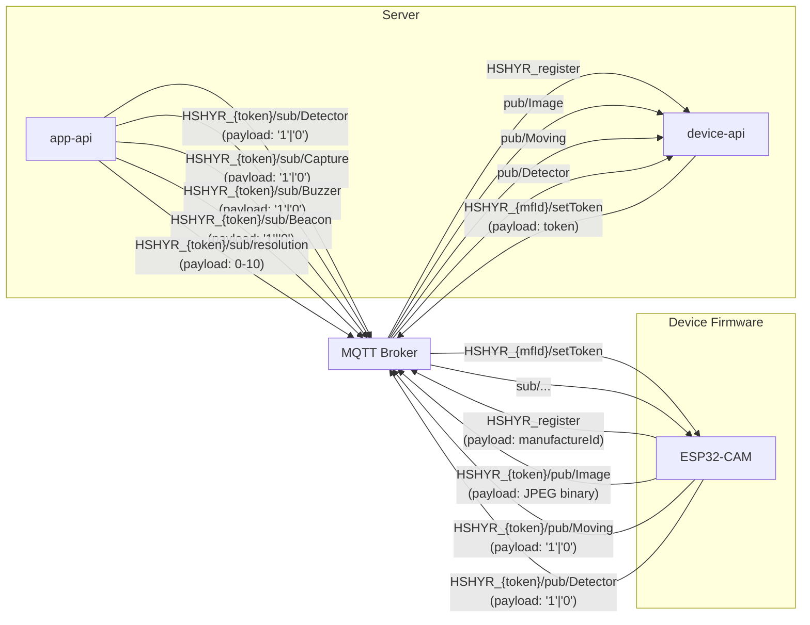

# @hushiar/shared-types

Central TypeScript type library shared across all packages and apps. Contains entity interfaces, MQTT protocol constants, DTOs, manager interface contracts, and error classes.

No runtime dependencies — purely TypeScript declarations compiled to `.d.ts` files.

---

## Table of Contents

- [Exports Overview](#exports-overview)
- [Entity Interfaces](#entity-interfaces)
- [MQTT Protocol Contract](#mqtt-protocol-contract)
- [Domain Events](#domain-events)
- [Manager Interfaces](#manager-interfaces)
- [DTOs](#dtos)
- [Error Classes](#error-classes)

---

## Exports Overview

```
src/
├── entities/       14 entity interfaces (MongoDB document shapes)
├── events/         3 domain event types
├── mqtt/           MQTT topic constants, builder functions, topic types
├── managers/       Manager interface contracts
├── dto/            Request / response shapes
└── errors/         AppError hierarchy
```

---

## Entity Interfaces

### `IUser`

| Field | Type | Description |
|-------|------|-------------|
| `registerDate` | `Date?` | Account creation date |
| `title` | `string?` | Display name |
| `mobileNumber` | `string` | Phone number used for SMS OTP |
| `email` | `string?` | Optional email |
| `isValid` | `boolean?` | Whether account is valid |
| `credit` | `number?` | Account credit balance |
| `wpSubList` | `WebPushSubscription[]?` | Browser push subscription objects |
| `isMobileNumberConfirmed` | `boolean?` | Whether mobile number has been verified |
| `lastWPDateTime` | `Date \| null?` | Timestamp of last web push sent (throttle guard) |
| `lastSMSDateTime` | `Date \| null?` | Timestamp of last SMS sent (throttle guard) |
| `storageMaxSize` | `number?` | Disk quota in MB |
| `storageUsedSize` | `number?` | Disk used in MB |
| `storageRemainedSize` | `number?` | Disk remaining in MB |
| `remainingDays` | `number?` | Subscription days remaining (typo fixed from legacy `remaningDays`) |

`WebPushSubscription` — `{ endpoint: string; keys: { p256dh: string; auth: string } }`

`IUserPopulated` — extends `IUser` and adds `_id: Types.ObjectId`.

### `IDevice`

| Field | Type | Description |
|-------|------|-------------|
| `registerDate` | `Date` | Registration timestamp |
| `title` | `string` | Camera/device label |
| `manufactureId` | `string` | Unique hardware ID burned into firmware |
| `type` | `string` | Device type |
| `status` | `string` | Alarm mode |
| `isOn` | `boolean` | Whether device is powered on |
| `isMonitoring` | `boolean` | Whether motion detection is running |
| `isOnAlarm` | `boolean` | Whether alarm is active |
| `isMoving` | `boolean` | Live motion state |
| `isLightOn` | `boolean` | Whether device light is on |
| `temperature` | `number?` | Sensor reading (typo fixed from legacy `temperture`) |
| `user` | `Types.ObjectId?` | Owner reference |
| `location` | `Types.ObjectId?` | Location reference |
| `token` | `string?` | Rotating MQTT auth token (set at registration) |
| `mqttUserName` | `string` | MQTT username |
| `mqttPassword` | `string` | AES-256-CBC encrypted MQTT credential |

`IDevicePopulated` — extends `Omit<IDevice, 'user' | 'location'>` with `_id: Types.ObjectId`, `user: (IUser & { _id: Types.ObjectId }) | null`, `location: (ILocation & { _id: Types.ObjectId }) | null`.

### `ISensor`

| Field | Type | Notes |
|-------|------|-------|
| `registerDate` | `Date` | Registration timestamp |
| `manufactureId` | `string` | Unique hardware ID |
| `type` | `string` | Sensor type (e.g. `'Detector'`) |
| `device` | `Types.ObjectId?` | Attached device |
| `isActive` | `boolean?` | Enabled/disabled |
| `status` | `string?` | Current state (typo fixed from legacy `staus`) |

### `IActuator`

| Field | Type | Notes |
|-------|------|-------|
| `registerDate` | `Date` | Registration timestamp |
| `manufactureId` | `string` | Unique hardware ID |
| `type` | `string` | Actuator type (e.g. `'Capture' \| 'Buzzer' \| 'Beacon'`) |
| `device` | `Types.ObjectId?` | Attached device |
| `isActive` | `boolean?` | Enabled/disabled |
| `status` | `string?` | Current state (typo fixed from legacy `staus`) |

### `IImage`

| Field | Type | Description |
|-------|------|-------------|
| `registerDate` | `Date` | Capture timestamp |
| `device` | `Types.ObjectId` | Source device |
| `actuator` | `Types.ObjectId?` | Capture actuator reference |
| `file` | `unknown?` | Raw file data |
| `fileName` | `string` | Stored filename on disk |

### `IArchive`

| Field | Type | Description |
|-------|------|-------------|
| `startDate` | `Date` | Start of the captured interval |
| `endDate` | `Date?` | End of the captured interval |
| `duration` | `number?` | Duration in seconds |
| `device` | `Types.ObjectId` | Source device |
| `sensor` | `Types.ObjectId?` | Source sensor |
| `isMoving` | `boolean?` | Whether motion was detected |
| `hasHighSound` | `boolean?` | High sound flag |
| `hasHighTemperature` | `boolean?` | High temp flag (typo fixed from `hasHighTemperture`) |
| `videoFileName` | `string?` | Generated video filename |
| `imageList` | `Types.ObjectId[]?` | Image IDs included in the archive |

### `ILog`

| Field | Type | Description |
|-------|------|-------------|
| `registerDate` | `Date` | Log timestamp |
| `type` | `string` | Log category |
| `logData` | `unknown` | Arbitrary log payload |
| `device` | `Types.ObjectId` | Source device |
| `user` | `Types.ObjectId` | Owner user |

### `ICommand`

| Field | Type | Description |
|-------|------|-------------|
| `registerDate` | `Date` | Command creation timestamp |
| `device` | `Types.ObjectId` | Target device |
| `actuator` | `Types.ObjectId?` | Target actuator |
| `sensor` | `Types.ObjectId?` | Target sensor |
| `command` | `string` | Command string |
| `logData` | `unknown[]?` | Execution result data |
| `fetchDate` | `Date?` | When device fetched the command |
| `isDone` | `boolean?` | Whether command completed |

### `IAuth`

| Field | Type | Description |
|-------|------|-------------|
| `authToken` | `number` | Numeric OTP code |
| `createDate` | `Date` | Token creation date |
| `user` | `Types.ObjectId` | Owner user |
| `subscriber` | `Types.ObjectId?` | Subscriber reference |
| `enterDate` | `Date?` | When token was verified |

### `IDeviceType`

| Field | Type | Description |
|-------|------|-------------|
| `title` | `string` | Device model name |
| `price` | `number` | Base price |
| `payablePrice` | `number` | Price after discounts |
| `description` | `string` | Model description |
| `headImage` | `string` | Primary image URL |
| `imageList` | `string[]` | Gallery image URLs |
| `isAvailable` | `boolean` | Whether model is purchasable (typo fixed from `isAvaliable`) |

### `ILocation`

| Field | Type | Description |
|-------|------|-------------|
| `registerDate` | `Date` | Creation date |
| `title` | `string` | Location name |
| `address` | `string` | Physical address |
| `user` | `Types.ObjectId` | Owner user |

### `IStorage`

| Field | Type | Description |
|-------|------|-------------|
| `registerDate` | `Date` | Creation date |
| `user` | `Types.ObjectId` | Owner user |
| `usedSize` | `number` | Disk used in MB |
| `maxSize` | `number` | Disk quota in MB |

### `ISubscriber`

| Field | Type | Description |
|-------|------|-------------|
| `registerDate` | `Date` | Creation date |
| `title` | `string` | Subscriber display name |
| `mobileNumber` | `string` | Subscriber phone number |
| `device` | `Types.ObjectId` | Associated device |
| `accessEndDate` | `Date` | Subscription end date |

### `IVerbose`

| Field | Type | Description |
|-------|------|-------------|
| `registerDate` | `Date` | Timestamp |
| `data` | `unknown` | Debug payload |
| `device` | `Types.ObjectId` | Source device |

---

## MQTT Protocol Contract

> **Hardware contract.** The strings below are hardcoded in device firmware. Any change to a topic string, prefix, or payload format will break physical devices in the field without any compile-time warning.

### Constants

```typescript
export const MQTT_PREFIX = 'HSHYR';

export const MQTT_TOPICS = {
  REGISTER:   'HSHYR_register',
  IMAGE:      'Image',
  MOVING:     'Moving',
  DETECTOR:   'Detector',
  CAPTURE:    'Capture',
  BUZZER:     'Buzzer',
  BEACON:     'Beacon',
  RESOLUTION: 'resolution',
} as const;

export type MqttTopicValue = (typeof MQTT_TOPICS)[keyof typeof MQTT_TOPICS];

export const SENSOR_TOPIC_LIST   = ['Detector'] as const;
export const ACTUATOR_TOPIC_LIST = ['Capture', 'Buzzer', 'Beacon'] as const;

export type SensorTopic   = typeof SENSOR_TOPIC_LIST[number];    // 'Detector'
export type ActuatorTopic = typeof ACTUATOR_TOPIC_LIST[number];  // 'Capture' | 'Buzzer' | 'Beacon'
```

### Topic Builder Functions

```typescript
// Device → Server (device publishes, server subscribes)
buildPubTopic(token: string, type: string): string
// → 'HSHYR_{token}/pub/{type}'

// Server → Device (server publishes, device subscribes)
buildSubTopic(token: string, type: string): string
// → 'HSHYR_{token}/sub/{type}'
```

### Topic Translation

```typescript
interface TopicTranslation {
  deviceToken: string;
  topic: MqttTopicValue;
  direction: 'pub' | 'sub';
}
```

### Full Topic Map



### Payload Encoding

| Topic | Direction | Payload | Type |
|-------|-----------|---------|------|
| `HSHYR_register` | Device → Server | manufacture ID string | UTF-8 text |
| `{token}/pub/Image` | Device → Server | raw JPEG frame | binary `Buffer` |
| `{token}/pub/Moving` | Device → Server | `"1"` moving / `"0"` stopped | UTF-8 text |
| `{token}/pub/Detector` | Device → Server | `"1"` active / `"0"` idle | UTF-8 text |
| `{token}/pub/Capture` | Device → Server | `"1"` / `"0"` | UTF-8 text |
| `{token}/pub/Buzzer` | Device → Server | `"1"` / `"0"` | UTF-8 text |
| `{token}/pub/Beacon` | Device → Server | `"1"` / `"0"` | UTF-8 text |
| `{mfId}/setToken` | Server → Device | token string | UTF-8 text |
| `{token}/sub/Detector` | Server → Device | `"1"` enable / `"0"` disable | UTF-8 text |
| `{token}/sub/Capture` | Server → Device | `"1"` / `"0"` | UTF-8 text |
| `{token}/sub/Buzzer` | Server → Device | `"1"` / `"0"` | UTF-8 text |
| `{token}/sub/Beacon` | Server → Device | `"1"` / `"0"` | UTF-8 text |
| `{token}/sub/resolution` | Server → Device | `"0"`–`"10"` | UTF-8 text |

---

## Domain Events

```typescript
interface MotionEvent {
  deviceId:    Types.ObjectId;
  deviceToken: string;
  timestamp:   Date;
  isMoving:    boolean;
}

interface ImageCaptureEvent {
  deviceId:    Types.ObjectId;
  deviceToken: string;
  fileName:    string;
  timestamp:   Date;
}

interface DeviceRegisteredEvent {
  deviceId:      Types.ObjectId;
  manufactureId: string;
  token:         string;
  timestamp:     Date;
}
```

---

## Manager Interfaces

Thin contracts consumed by `@hushiar/core` implementations and used by apps for dependency typing.

### `IUserManager`

| Method | Signature |
|--------|-----------|
| `get` | `(userId: string) => Promise<(IUser & { _id: Types.ObjectId }) \| null>` |
| `create` | `(title: string, mobileNumber: string) => Promise<IUser & { _id: Types.ObjectId }>` |
| `addWebPushSub` | `(userId: string, sub: WebPushSubscription) => Promise<IUser & { _id: Types.ObjectId }>` |
| `setLastWPDateTime` | `(userId: Types.ObjectId, date: Date) => Promise<void>` |
| `setLastSMSDateTime` | `(userId: Types.ObjectId, date: Date) => Promise<void>` |
| `deductRemainingDays` | `() => Promise<void>` |
| `setStorageUsage` | `(userId: Types.ObjectId, usedSize: number) => Promise<void>` |

### `IDeviceManager`

| Method | Signature |
|--------|-----------|
| `getAll` | `() => Promise<IDevicePopulated[]>` |
| `getAllByUser` | `(userId: string) => Promise<IDevicePopulated[]>` |
| `getByManufactureId` | `(manufactureId: string) => Promise<(IDevice & { _id: Types.ObjectId }) \| null>` |
| `add` | `(title: string, type: string, status: string) => Promise<IDevice & { _id: Types.ObjectId }>` |
| `setup` | `(userId: string, manufactureId: string) => Promise<IDevice & { _id: Types.ObjectId }>` |
| `setOnAlarm` | `(deviceId: Types.ObjectId, isOnAlarm: boolean) => Promise<void>` |
| `setMovingStatus` | `(deviceId: Types.ObjectId, isMoving: boolean) => Promise<void>` |
| `registerDeviceToken` | `(manufactureId: string) => Promise<{ token: string; mqttBroker: string }>` |

### `ISensorManager`

| Method | Signature |
|--------|-----------|
| `attachSensor` | `(deviceId: Types.ObjectId, type: string) => Promise<ISensor & { _id: Types.ObjectId }>` |
| `detachSensor` | `(sensorId: Types.ObjectId) => Promise<void>` |
| `getAllByDevice` | `(deviceId: Types.ObjectId) => Promise<(ISensor & { _id: Types.ObjectId })[]>` |

### `IActuatorManager`

| Method | Signature |
|--------|-----------|
| `attachActuator` | `(deviceId: Types.ObjectId, type: string) => Promise<IActuator & { _id: Types.ObjectId }>` |
| `detachActuator` | `(actuatorId: Types.ObjectId) => Promise<void>` |
| `getAllByDevice` | `(deviceId: Types.ObjectId) => Promise<(IActuator & { _id: Types.ObjectId })[]>` |

### `IImageManager`

| Method | Signature |
|--------|-----------|
| `add` | `(deviceId: Types.ObjectId, actuatorId: Types.ObjectId, fileName: string, file: unknown) => Promise<IImage & { _id: Types.ObjectId }>` |
| `getAllByDevice` | `(deviceId: Types.ObjectId) => Promise<(IImage & { _id: Types.ObjectId })[]>` |
| `getAllByDeviceAndTimeRange` | `(deviceId: Types.ObjectId, start: Date, end: Date) => Promise<(IImage & { _id: Types.ObjectId })[]>` |
| `removeByDevice` | `(deviceId: Types.ObjectId) => Promise<void>` |

### `IArchiveManager`

| Method | Signature |
|--------|-----------|
| `add` | `(deviceId: Types.ObjectId, sensorId: Types.ObjectId, start: Date, end: Date) => Promise<IArchive & { _id: Types.ObjectId }>` |
| `complete` | `(archiveId: Types.ObjectId, videoFileName: string, imageList: Types.ObjectId[]) => Promise<void>` |
| `getAllByDevice` | `(deviceId: Types.ObjectId) => Promise<(IArchive & { _id: Types.ObjectId })[]>` |

### `ILogManager`

| Method | Signature |
|--------|-----------|
| `ingestLog` | `(deviceId: Types.ObjectId, type: string, logData: unknown) => Promise<ILog & { _id: Types.ObjectId }>` |
| `getAllByDevice` | `(deviceId: Types.ObjectId) => Promise<(ILog & { _id: Types.ObjectId })[]>` |

### `ICommandManager`

| Method | Signature |
|--------|-----------|
| `add` | `(deviceId: Types.ObjectId, actuatorId: Types.ObjectId, command: string) => Promise<ICommand & { _id: Types.ObjectId }>` |
| `markDone` | `(commandId: Types.ObjectId) => Promise<void>` |
| `getPendingByDevice` | `(deviceId: Types.ObjectId) => Promise<(ICommand & { _id: Types.ObjectId })[]>` |

### `ILocationManager`

| Method | Signature |
|--------|-----------|
| `add` | `(userId: Types.ObjectId, title: string, address: string) => Promise<ILocation & { _id: Types.ObjectId }>` |
| `getAllByUser` | `(userId: Types.ObjectId) => Promise<(ILocation & { _id: Types.ObjectId })[]>` |
| `remove` | `(locationId: Types.ObjectId) => Promise<void>` |

### `IStorageManager`

| Method | Signature |
|--------|-----------|
| `getByUser` | `(userId: Types.ObjectId) => Promise<(IStorage & { _id: Types.ObjectId }) \| null>` |
| `setStorageUsage` | `(userId: Types.ObjectId, usedSize: number) => Promise<void>` |
| `reconcileStorage` | `() => Promise<void>` |

### `IAuthManager`

| Method | Signature |
|--------|-----------|
| `generateToken` | `(userId: string) => Promise<string>` |
| `validateToken` | `(token: string) => Promise<(IUser & { _id: Types.ObjectId }) \| null>` |

### `INotifyManager`

| Method | Signature |
|--------|-----------|
| `sendMovingAlert` | `(userId: Types.ObjectId, device: IDevicePopulated) => Promise<void>` |

### `IUserSmsUpdater`

| Method | Signature |
|--------|-----------|
| `setLastSMSDateTime` | `(userId: Types.ObjectId, date: Date) => Promise<void>` |

Thin interface used by `NotifyManager` to avoid circular imports.

---

## DTOs

Request/response shapes for the HTTP APIs. All live in `src/dto/index.ts`.

### Request DTOs

| DTO | Fields | Used by |
|-----|--------|---------|
| `LoginDto` | `mobileNumber: string` | `POST /user/signinWithMobileNumber` |
| `VerifyTokenDto` | `authToken: number`, `mobileNumber: string` | `POST /user/checkCodeWithMobileNumber` |
| `SetupDeviceDto` | `userId: string`, `manufactureId: string` | `POST /device/setup` |
| `SetDeviceStatusDto` | `deviceId: string`, `status: string` | `POST /device/setStatus` |
| `GetImageListDto` | `deviceId: string`, `startDate?: string`, `endDate?: string` | `POST /image/getAll_device` |
| `SendCommandDto` | `deviceId: string`, `actuatorId: string`, `command: string` | `POST /command/send` |
| `AddSubscriberDto` | `deviceId: string`, `title: string`, `mobileNumber: string`, `accessEndDate: string` | `POST /subscriber/add` |
| `WebPushSubscriptionDto` | `userId: string`, `subscription: WebPushSubscription` | `POST /user/subscribeWebPush` |

### Response DTOs

| DTO | Fields | Used by |
|-----|--------|---------|
| `ApiResponse<T>` | `data?: T`, `message?: string` | All endpoints |
| `PaginatedResponse<T>` | `data: T[]`, `total: number`, `page: number`, `limit: number` | List endpoints |
| `DeviceRegisterResponse` | `token: string`, `mqttBroker: string`, `mqttPort: number`, `mqttUsername: string`, `mqttPassword: string` | `GET /register/:manufactureId` |
| `DeviceStatusUpdate` | `deviceToken: string`, `status: string`, `value: string \| number \| boolean` | Socket.io event |

---

## Error Classes

```
AppError (base, HTTP 500)
├── NotFoundError    (HTTP 404)
├── AuthError        (HTTP 403)
├── ValidationError  (HTTP 422)
└── ConflictError    (HTTP 409)
```

All error classes carry a `statusCode` field. Route handlers catch `AppError` subclasses and forward `statusCode` + `message` to the HTTP response.
